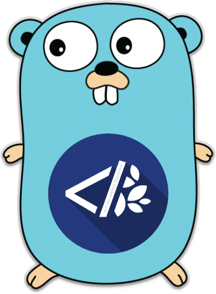

<p align="center"></p>

# nkn-openapi-client
A client library for the NKN OpenAPI written in go

```go
package main

import (
	"fmt"
	"log"

	client "github.com/omani/nkn-openapi-client"
)

func checkerr(err error) {
	if err != nil {
		log.Fatal(err)
	}
}

func main() {
	c := client.New()
	c.SetAddress("https://openapi.nkn.org/api/v1")

	resp, err := c.GetRegisteredNames()
	checkerr(err)

	for _, n := range resp.Data {
		fmt.Println(n.Name)
	}

	if !resp.HasMore() {
		return
	}
	// we have more than one page. fetch one more page.
	err = c.Next(resp)
	checkerr(err)

	for _, n := range resp.Data {
		fmt.Println(n.Name)
	}
}
```

This repository comes with a simple example CLI app in `cmd/`.

# CLI App 

## Install
`go install github.com/omani/nkn-openapi-client/cmd/nkn-openapi-client@latest`


## Usage
### Clone this repository
`git clone https://github.com/omani/nkn-openapi-client`

### Show transactions of an NKN wallet address:
```
cd cmd
go run main.go transactions --address NKNJ6Tka2rcrqT4FPJTjfoWQLjvahctSiyRF
```

### Show transactions with a given hash
```
cd cmd
go run main.go transactions --hash 993a8f8ec9ca3a295e8873c573759d11b844c698e0e50f4edd1fa50751c2d879
```

### Show block at a given height
```
cd cmd
go run main.go blocks --height 5648381
```

### Show block with a given hash
```
cd cmd
go run main.go blocks --hash 0d48328a5005e7455c6a5e2a0b5bc346b09fbae129f1775589be83657850656a
```

### Use your own NKN OpenAPI instance by providing a `--url` flag
```
cd cmd
go run main.go --url https://my-own-nkn-openapi.tld blocks --hash 0d48328a5005e7455c6a5e2a0b5bc346b09fbae129f1775589be83657850656a
```

# Contribution
* You can fork this, extend it and contribute back.
* You can contribute with pull requests.

# Donations
I accept payments and donations in BTC:

 `bc1qgezvfp4s0xme8pdv6aaqu9ayfgnv4mejdlv3tx`

# LICENSE
MIT License


